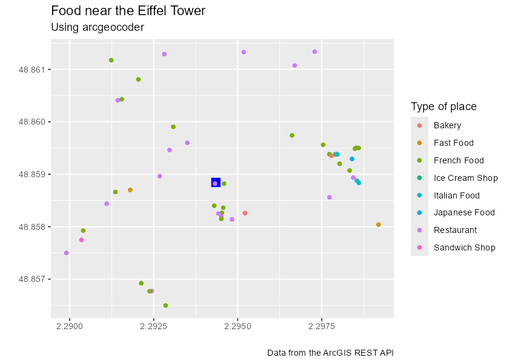
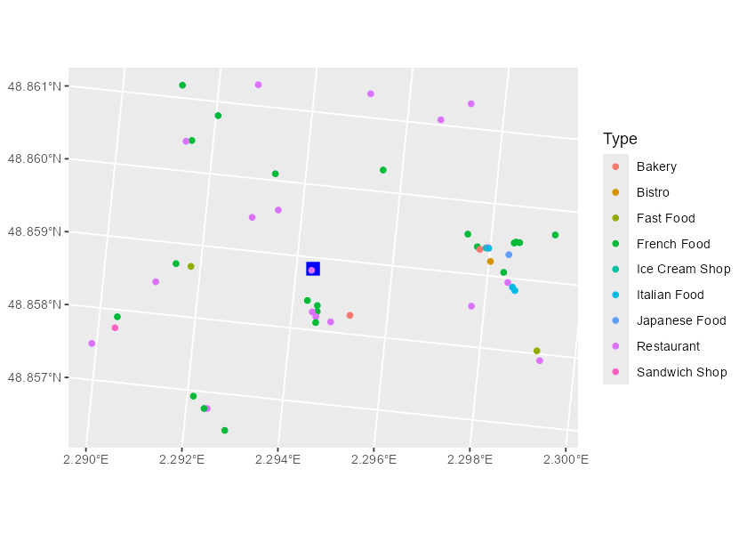

<!-- README.md is generated from README.qmd. Please edit that file -->

# arcgeocoder <a href="https://dieghernan.github.io/arcgeocoder/"></a>

<!-- badges: start -->

[](https://CRAN.R-project.org/package=arcgeocoder)
[](https://cran.r-project.org/web/checks/check_results_arcgeocoder.html)
[](https://CRAN.R-project.org/package=arcgeocoder)
[](https://github.com/dieghernan/arcgeocoder/actions/workflows/check-full.yaml)
[](https://app.codecov.io/gh/dieghernan/arcgeocoder)
[](https://coveralls.io/github/dieghernan/arcgeocoder)
[](https://dieghernan.r-universe.dev/arcgeocoder)
[](https://www.codefactor.io/repository/github/dieghernan/arcgeocoder)
[](https://www.repostatus.org/#active)
[](https://doi.org/10.32614/CRAN.package.arcgeocoder)
[](https://CRAN.R-project.org/package=arcgeocoder)

<!-- badges: end -->

**arcgeocoder** provides a lightweight interface to the [ArcGIS REST
API](https://developers.arcgis.com/rest/geocode/api-reference/overview-world-geocoding-service.htm).
It geocodes single-line and structured addresses, reverse geocodes
coordinates and finds places by category.

The full site with examples and vignettes is available at
<https://dieghernan.github.io/arcgeocoder/>.

## Why arcgeocoder?

**arcgeocoder** accesses the ArcGIS REST API without requiring an API
key or an additional HTTP package such as **curl**. It uses base R
download functions, which keeps its dependency footprint small.

The package provides focused interfaces to the `findAddressCandidates`
and `reverseGeocode` endpoints. It supports single-line addresses,
structured address components, category filters and reverse geocoding.

## Recommended packages

The following packages provide related geocoding features:

- [**tidygeocoder**](https://jessecambon.github.io/tidygeocoder/)
  ([Cambon et al. 2021](#ref-R-tidygeocoder)) provides an interface to
  ArcGIS, Nominatim (OpenStreetMap), Google, TomTom, Mapbox and other
  geocoding services.
- [**nominatimlite**](https://dieghernan.github.io/nominatimlite/)
  ([Hernangómez 2024](#ref-R-nominatimlite)) is similar to
  **arcgeocoder** but uses data from OpenStreetMap through the
  [Nominatim API](https://nominatim.org/release-docs/latest/).

## Installation

<div class="pkgdown-release">

Install **arcgeocoder** from
[**CRAN**](https://CRAN.R-project.org/package=arcgeocoder) with:

``` r
install.packages("arcgeocoder")
```

</div>

<div class="pkgdown-devel">

Read the documentation for the development version at
<https://dieghernan.github.io/arcgeocoder/dev/>.

You can install the development version of **arcgeocoder** with:

``` r
# install.packages("pak")
pak::pak("dieghernan/arcgeocoder")
```

Alternatively, you can install **arcgeocoder** using the
[r-universe](https://dieghernan.r-universe.dev/arcgeocoder):

``` r
# Install arcgeocoder in R.
install.packages(
  "arcgeocoder",
  repos = c(
    "https://dieghernan.r-universe.dev",
    "https://cloud.r-project.org"
  )
)
```

</div>

## Usage

### Geocoding and reverse geocoding

*The examples in this section are adapted from the **tidygeocoder**
package.*

The `arc_geo()` function converts single-line addresses into geographic
coordinates. It requires no API key or additional setup.

``` r
library(arcgeocoder)
library(dplyr)

# Create a data frame with addresses.
some_addresses <- tribble(
  ~name, ~addr,
  "White House", "1600 Pennsylvania Ave NW, Washington, DC",
  "Transamerica Pyramid", "600 Montgomery St, San Francisco, CA 94111",
  "Willis Tower", "233 S Wacker Dr, Chicago, IL 60606"
)

# Geocode the addresses.
lat_longs <- arc_geo(
  some_addresses$addr,
  lat = "latitude",
  long = "longitude",
  progressbar = FALSE
)
```

By default, `arc_geo()` returns a small set of fields. Set
`full_results = TRUE` to return all available API fields.

| query | latitude | longitude | address | score | x | y | xmin | ymin | xmax | ymax | wkid | latestWkid |
|:---|---:|---:|:---|---:|---:|---:|---:|---:|---:|---:|---:|---:|
| 1600 Pennsylvania Ave NW, Washington, DC | 38.89768 | -77.03655 | 1600 Pennsylvania Ave NW, Washington, District of Columbia, 20500 | 100 | -77.03655 | 38.89768 | -77.03755 | 38.89668 | -77.03555 | 38.89868 | 4326 | 4326 |
| 600 Montgomery St, San Francisco, CA 94111 | 37.79516 | -122.40273 | 600 Montgomery St, San Francisco, California, 94111 | 100 | -122.40273 | 37.79516 | -122.40373 | 37.79416 | -122.40173 | 37.79616 | 4326 | 4326 |
| 233 S Wacker Dr, Chicago, IL 60606 | 41.87867 | -87.63587 | 233 S Wacker Dr, Chicago, Illinois, 60606 | 100 | -87.63587 | 41.87867 | -87.63687 | 41.87767 | -87.63487 | 41.87967 | 4326 | 4326 |

<p class="caption">

Table 1: Example: geocoding addresses.
</p>

The `arc_reverse_geo()` function converts longitude and latitude values
into addresses. Supply longitude values to `x` and latitude values to
`y`. The following example uses the coordinates returned by the previous
query. The `address` argument sets the name of the address column in the
output.

``` r
reverse <- arc_reverse_geo(
  x = lat_longs$longitude,
  y = lat_longs$latitude,
  address = "address_found",
  progressbar = FALSE
)
```

| x | y | address_found |
|---:|---:|:---|
| -77.03655 | 38.89768 | White House, 1600 Pennsylvania Ave NW, Washington, DC, 20500, USA |
| -122.40273 | 37.79516 | Chess Ventures, 600 Montgomery St, San Francisco, CA, 94111, USA |
| -87.63587 | 41.87867 | The Metropolitan, 233 South Wacker Drive, Chicago, IL, 60606, USA |

<p class="caption">

Table 2: Example: reverse geocoding addresses.
</p>

The `arc_geo_categories()` function finds places by category near a
location or within a bounding box. Available categories are documented
in the `arc_categories` dataset and in the [ArcGIS category filtering
documentation](https://developers.arcgis.com/rest/geocode/api-reference/geocoding-category-filtering.htm).

The following example finds food-related places, such as restaurants,
coffee shops and bakeries, near the Eiffel Tower in France.

``` r
library(ggplot2) # For plotting.

# Step 1: Locate the Eiffel Tower using a structured query.

eiffel_tower <- arc_geo_multi(
  address = "Tour Eiffel",
  city = "Paris",
  countrycode = "FR",
  langcode = "FR",
  custom_query = list(outFields = "LongLabel")
)

# Display results.
eiffel_tower |>
  select(lon, lat, LongLabel)
#> # A tibble: 1 × 3
#>     lon   lat LongLabel                                                         
#>   <dbl> <dbl> <chr>                                                             
#> 1  2.29  48.9 Tour Eiffel, 3 Rue de l'Université, 75007, 7e Arrondissement, Par…

# Use `lon` and `lat` as a reference location for `category = "Food"`.
food_eiffel <- arc_geo_categories(
  "Food",
  x = eiffel_tower$lon,
  y = eiffel_tower$lat,
  limit = 50,
  full_results = TRUE
)

# Plot by food type.
ggplot(eiffel_tower, aes(x, y)) +
  geom_point(shape = 15, color = "blue", size = 4) +
  geom_point(data = food_eiffel, aes(x, y, color = Type)) +
  labs(
    title = "Food near the Eiffel Tower",
    subtitle = "Using arcgeocoder",
    color = "Type of place",
    x = "",
    y = "",
    caption = "Data from the ArcGIS REST API"
  )
```



### Convert results to spatial data

Use the longitude and latitude columns returned by **arcgeocoder** to
create an **sf** object:

``` r
library(sf)

eiffel_tower_sf <- eiffel_tower |>
  select(lon, lat, LongLabel) |>
  st_as_sf(
    coords = c("lon", "lat"),
    # Set the CRS of the resulting coordinates.
    crs = eiffel_tower$wkid
  )

food_eiffel_sf <- st_as_sf(food_eiffel,
  coords = c("lon", "lat"),
  crs = eiffel_tower$wkid
)

ggplot(eiffel_tower_sf) +
  geom_sf(shape = 15, color = "blue", size = 4) +
  geom_sf(data = food_eiffel_sf, aes(color = Type)) +
  coord_sf(crs = 3035)
```



## Citation

<p>

Hernangómez D (2026). <em>arcgeocoder: Address and Coordinate Search
with the ArcGIS REST API</em>.
<a href="https://doi.org/10.32614/CRAN.package.arcgeocoder">doi:10.32614/CRAN.package.arcgeocoder</a>.
<a href="https://dieghernan.github.io/arcgeocoder/">https://dieghernan.github.io/arcgeocoder/</a>.
</p>

A BibTeX entry for LaTeX users is shown below.

    @Manual{R-arcgeocoder,
      title = {{arcgeocoder}: Address and Coordinate Search with the {ArcGIS} {REST} {API}},
      doi = {10.32614/CRAN.package.arcgeocoder},
      author = {Diego Hernangómez},
      year = {2026},
      version = {0.4.1},
      url = {https://dieghernan.github.io/arcgeocoder/},
      abstract = {Provides a lightweight interface to the ArcGIS REST API for converting addresses and structured address components into geographic coordinates, finding places by category and converting coordinates into addresses. It uses the ArcGIS service documented at <https://developers.arcgis.com/rest/geocode/api-reference/overview-world-geocoding-service.htm>. No API key is required.},
    }

## References

<div id="refs" class="references csl-bib-body hanging-indent">

<div id="ref-R-tidygeocoder" class="csl-entry">

Cambon, Jesse, Diego Hernangómez, Christopher Belanger, and Daniel
Possenriede. 2021. “<span class="nocase">tidygeocoder</span>: An R
Package for Geocoding.” *Journal of Open Source Software* 6 (65): 3544.
<https://doi.org/10.21105/joss.03544>.

</div>

<div id="ref-R-nominatimlite" class="csl-entry">

Hernangómez, Diego. 2024. *<span class="nocase">nominatimlite</span>:
Interface with Nominatim API Service*. Version 0.2.1.
<https://doi.org/10.5281/zenodo.5113195>.

</div>

</div>
