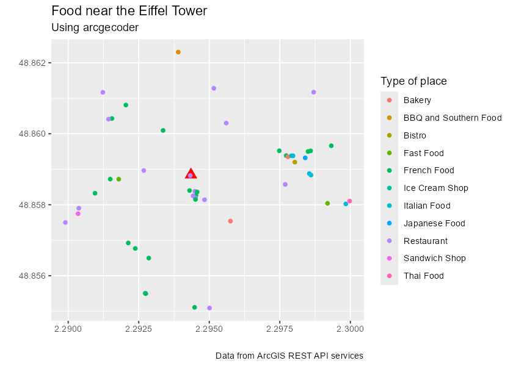
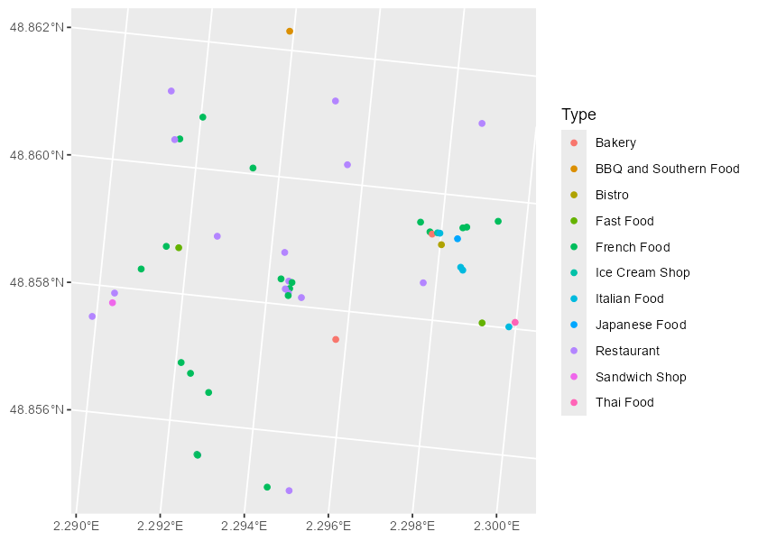

<!-- README.md is generated from README.qmd. Please edit that file -->

# arcgeocoder <a href="https://dieghernan.github.io/arcgeocoder/"></a>

<!-- badges: start -->

[](https://CRAN.R-project.org/package=arcgeocoder)
[](https://cran.r-project.org/web/checks/check_results_arcgeocoder.html)
[](https://CRAN.R-project.org/package=arcgeocoder)
[](https://github.com/dieghernan/arcgeocoder/actions/workflows/check-full.yml)
[](https://app.codecov.io/gh/dieghernan/arcgeocoder)
[](https://dieghernan.r-universe.dev/arcgeocoder)
[](https://www.codefactor.io/repository/github/dieghernan/arcgeocoder)
[](https://www.repostatus.org/#active)
[](https://doi.org/10.32614/CRAN.package.arcgeocoder)
[](https://CRAN.R-project.org/package=arcgeocoder)

<!-- badges: end -->

The goal of **arcgeocoder** is to provide a light interface for
geocoding addresses and reverse geocoding locations through the [ArcGIS
REST API Geocoding
Service](https://developers.arcgis.com/rest/geocode/api-reference/overview-world-geocoding-service.htm).

Full site with examples and vignettes on
<https://dieghernan.github.io/arcgeocoder/>

## Why arcgeocoder?

**arcgeocoder** is a package that provides a lightweight interface for
geocoding and reverse geocoding with the ArcGIS REST API service. The
goal of **arcgeocoder** is to access the ArcGIS REST API with fewer
dependencies, such as **curl**. In some situations, **curl** may not be
available or accessible, so **arcgeocoder** uses base functions to
overcome this limitation.

The interface of **arcgeocoder** is built with the aim of easing the
access to all the features provided by the API. The API endpoints used
by **arcgeocoder** are `findAddressCandidates` and `reverseGeocode`,
which can be accessed <u>**without**</u> the need for an <u>**API
key**</u>.

## Recommended packages

There are other packages much more complete and mature than
**arcgeocoder**, that present similar features:

- [**tidygeocoder**](https://jessecambon.github.io/tidygeocoder/)
  ([Cambon et al. 2021](#ref-R-tidygeocoder)). Allows to interface with
  ArcGIS, Nominatim (OpenStreetMaps), Google, TomTom, Mapbox, etc. for
  geocoding and reverse geocoding.
- [**nominatimlite**](https://dieghernan.github.io/nominatimlite/)
  ([Hernangómez 2024](#ref-R-nominatimlite)). Similar to **arcgeocoder**
  but using data from OpenStreetMaps trough the [Nominatim
  API](https://nominatim.org/release-docs/latest/) service.

## Installation

<div class="pkgdown-release">

Install **arcgeocoder** from
[**CRAN**](https://CRAN.R-project.org/package=arcgeocoder) with:

``` r
install.packages("arcgeocoder")
```

</div>

<div class="pkgdown-devel">

Check the docs of the developing version
in <https://dieghernan.github.io/arcgeocoder/dev/>.

You can install the developing version of **arcgeocoder** with:

``` r
# install.packages("pak")
pak::pak("dieghernan/arcgeocoder")
```

Alternatively, you can install **arcgeocoder** using the
[r-universe](https://dieghernan.r-universe.dev/arcgeocoder):

``` r
# Install arcgeocoder in R:
install.packages(
  "arcgeocoder",
  repos = c(
    "https://dieghernan.r-universe.dev",
    "https://cloud.r-project.org"
  )
)
```

</div>

## Usage

### Geocoding and reverse geocoding

*Note: examples adapted from **tidygeocoder** package*

In this first example we will geocode a few addresses using the
`arc_geo()` function. Note that **arcgeocoder** works straight away, and
you don’t need to provide any API key to start geocoding!

``` r
library(arcgeocoder)
library(dplyr)

# create a dataframe with addresses
some_addresses <- tribble(
  ~name, ~addr,
  "White House", "1600 Pennsylvania Ave NW, Washington, DC",
  "Transamerica Pyramid", "600 Montgomery St, San Francisco, CA 94111",
  "Willis Tower", "233 S Wacker Dr, Chicago, IL 60606"
)

# geocode the addresses
lat_longs <- arc_geo(
  some_addresses$addr,
  lat = "latitude",
  long = "longitude",
  progressbar = FALSE
)
```

Only a few fields are returned from the geocoder service in this
example, but `full_results = TRUE` can be used to return all of the data
from the geocoder service.

| query | latitude | longitude | address | score | x | y | xmin | ymin | xmax | ymax | wkid | latestWkid |
|:---|---:|---:|:---|---:|---:|---:|---:|---:|---:|---:|---:|---:|
| 1600 Pennsylvania Ave NW, Washington, DC | 38.89768 | -77.03655 | 1600 Pennsylvania Ave NW, Washington, District of Columbia, 20500 | 100 | -77.03655 | 38.89768 | -77.03755 | 38.89668 | -77.03555 | 38.89868 | 4326 | 4326 |
| 600 Montgomery St, San Francisco, CA 94111 | 37.79516 | -122.40273 | 600 Montgomery St, San Francisco, California, 94111 | 100 | -122.40273 | 37.79516 | -122.40373 | 37.79416 | -122.40173 | 37.79616 | 4326 | 4326 |
| 233 S Wacker Dr, Chicago, IL 60606 | 41.87867 | -87.63587 | 233 S Wacker Dr, Chicago, Illinois, 60606 | 100 | -87.63587 | 41.87867 | -87.63687 | 41.87767 | -87.63487 | 41.87967 | 4326 | 4326 |

<p class="caption">

Table 1: Example: geocoding addresses.
</p>

To perform reverse geocoding (obtaining addresses from geographic
coordinates), we can use the `arc_reverse_geo()` function. The arguments
are similar to the `arc_geo()` function, but now we specify the input
data columns with the `x` and `y` arguments. The dataset used here is
from the geocoder query above. The single line address is returned in a
column named by the `address`.

``` r
reverse <- arc_reverse_geo(
  x = lat_longs$longitude,
  y = lat_longs$latitude,
  address = "address_found",
  progressbar = FALSE
)
```

| x | y | address_found |
|---:|---:|:---|
| -77.03655 | 38.89768 | White House, 1600 Pennsylvania Ave NW, Washington, DC, 20500, USA |
| -122.40273 | 37.79516 | Chess Ventures, 600 Montgomery St, San Francisco, CA, 94111, USA |
| -87.63587 | 41.87867 | The Metropolitan, 233 South Wacker Drive, Chicago, IL, 60606, USA |

<p class="caption">

Table 2: Example: reverse geocoding addresses.
</p>

It is possible also to search for specific locations within or near a
reference area or location using [category
filtering](https://developers.arcgis.com/rest/geocode/api-reference/geocoding-category-filtering.htm).
See more information in the documentation of the data base
`arc_categories`.

In the following example we would look for POIs related to food (i.e.
Restaurants, Coffee Shops, Bakeries) near the Eiffel Tower in France.

``` r
library(ggplot2) # For plotting

# Step 1: Locate Eiffel Tower, using multifield query

eiffel_tower <- arc_geo_multi(
  address = "Tour Eiffel",
  city = "Paris",
  countrycode = "FR",
  langcode = "FR",
  custom_query = list(outFields = "LongLabel")
)

# Display results
eiffel_tower |>
  select(lon, lat, LongLabel)
#> # A tibble: 1 × 3
#>     lon   lat LongLabel                                                         
#>   <dbl> <dbl> <chr>                                                             
#> 1  2.29  48.9 Tour Eiffel, 3 Rue de l'Université, 75007, 7e Arrondissement, Par…


# Use lon,lat to boost the search and using category = Food
food_eiffel <- arc_geo_categories(
  "Food",
  x = eiffel_tower$lon,
  y = eiffel_tower$lat,
  limit = 50,
  full_results = TRUE
)

# Plot by Food Type
ggplot(eiffel_tower, aes(x, y)) +
  geom_point(shape = 17, color = "red", size = 4) +
  geom_point(data = food_eiffel, aes(x, y, color = Type)) +
  labs(
    title = "Food near the Eiffel Tower",
    subtitle = "Using arcgeocoder",
    color = "Type of place",
    x = "",
    y = "",
    caption = "Data from ArcGIS REST API services"
  )
```



### arcgeocoder and r-spatial

It is straightforward to convert the results of **arcgeocoder** to an
**sf** object (geospatial format):

``` r
library(sf)

food_eiffel_sf <- st_as_sf(
  food_eiffel,
  coords = c("lon", "lat"),
  # The CRS of the resulting coords is here
  crs = eiffel_tower$wkid
)

food_eiffel_sf
#> Simple feature collection with 50 features and 84 fields
#> Geometry type: POINT
#> Dimension:     XY
#> Bounding box:  xmin: 2.2899 ymin: 48.85509 xmax: 2.299974 ymax: 48.8623
#> Geodetic CRS:  WGS 84
#> # A tibble: 50 × 85
#>    q_category   q_x   q_y q_bbox_xmin q_bbox_ymin q_bbox_xmax q_bbox_ymax
#>  * <chr>      <dbl> <dbl> <lgl>       <lgl>       <lgl>       <lgl>      
#>  1 Food        2.29  48.9 NA          NA          NA          NA         
#>  2 Food        2.29  48.9 NA          NA          NA          NA         
#>  3 Food        2.29  48.9 NA          NA          NA          NA         
#>  4 Food        2.29  48.9 NA          NA          NA          NA         
#>  5 Food        2.29  48.9 NA          NA          NA          NA         
#>  6 Food        2.29  48.9 NA          NA          NA          NA         
#>  7 Food        2.29  48.9 NA          NA          NA          NA         
#>  8 Food        2.29  48.9 NA          NA          NA          NA         
#>  9 Food        2.29  48.9 NA          NA          NA          NA         
#> 10 Food        2.29  48.9 NA          NA          NA          NA         
#> # ℹ 40 more rows
#> # ℹ 78 more variables: address <chr>, score <int>, x <dbl>, y <dbl>,
#> #   Loc_name <chr>, Status <chr>, Score <int>, Match_addr <chr>,
#> #   LongLabel <chr>, ShortLabel <chr>, Addr_type <chr>, Type <chr>,
#> #   PlaceName <chr>, Place_addr <chr>, Phone <chr>, URL <chr>, Rank <int>,
#> #   AddBldg <chr>, AddNum <chr>, AddNumFrom <chr>, AddNumTo <chr>,
#> #   AddRange <chr>, Side <chr>, StPreDir <chr>, StPreType <chr>, …

ggplot(food_eiffel_sf) +
  geom_sf(aes(color = Type)) +
  coord_sf(crs = 3035)
```



## Citation

<p>

Hernangómez D (2026). <em>arcgeocoder: Geocoding with the ArcGIS REST
API Service</em>.
<a href="https://doi.org/10.32614/CRAN.package.arcgeocoder">doi:10.32614/CRAN.package.arcgeocoder</a>,
<a href="https://dieghernan.github.io/arcgeocoder/">https://dieghernan.github.io/arcgeocoder/</a>.
</p>

A BibTeX entry for LaTeX users is

    @Manual{R-arcgeocoder,
      title = {{arcgeocoder}: Geocoding with the {ArcGIS} {REST} {API} Service},
      doi = {10.32614/CRAN.package.arcgeocoder},
      author = {Diego Hernangómez},
      year = {2026},
      version = {0.3.0.9000},
      url = {https://dieghernan.github.io/arcgeocoder/},
      abstract = {Lite interface for finding locations of addresses or businesses around the world using the ArcGIS REST API service <https://developers.arcgis.com/rest/geocode/api-reference/overview-world-geocoding-service.htm>. Address text can be converted to location candidates and a location can be converted into an address. No API key required.},
    }

## References

<div id="refs" class="references csl-bib-body hanging-indent"
entry-spacing="0">

<div id="ref-R-tidygeocoder" class="csl-entry">

Cambon, Jesse, Diego Hernangómez, Christopher Belanger, and Daniel
Possenriede. 2021. “<span class="nocase">tidygeocoder</span>: An R
Package for Geocoding.” *Journal of Open Source Software* 6 (65): 3544.
<https://doi.org/10.21105/joss.03544>.

</div>

<div id="ref-R-nominatimlite" class="csl-entry">

Hernangómez, Diego. 2024. *<span class="nocase">nominatimlite</span>:
Interface with Nominatim API Service* (version 0.2.1).
<https://doi.org/10.5281/zenodo.5113195>.

</div>

</div>
