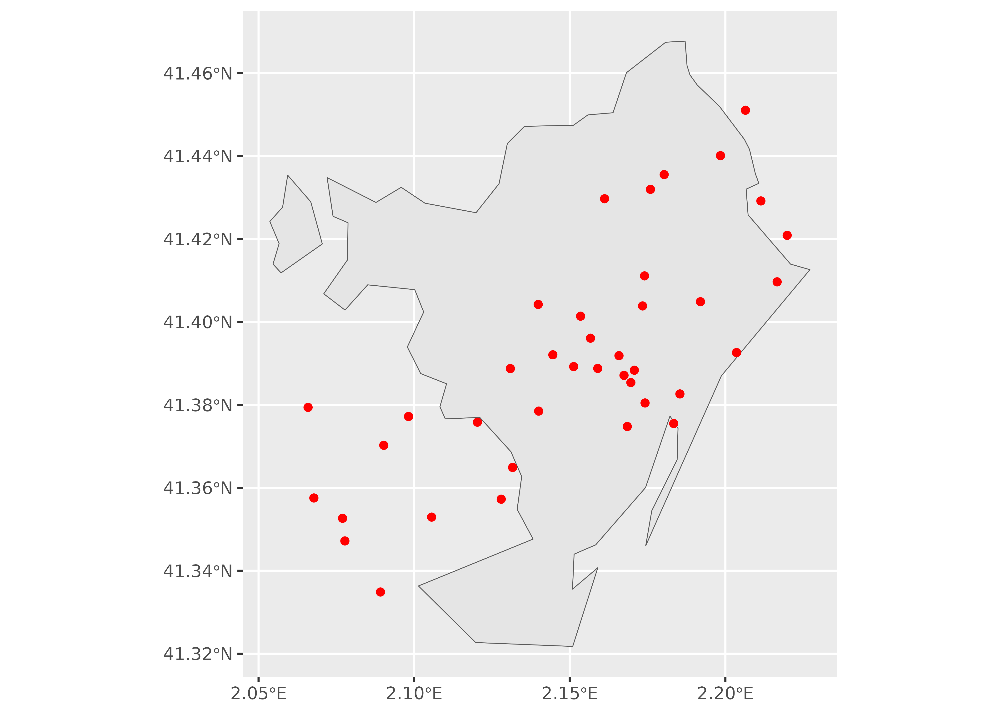

# arcgeocoder and static maps

## Example 1: sf objects

The following example shows how it is possible to create a nice static
map with data retrieved with **arcgeocoder** and converted to an **sf**
object:

``` r
library(arcgeocoder)
library(dplyr)
library(sf) # spatial objects
library(ggplot2)
library(mapSpain) # sf objects of Spain

# McDonalds in Barcelona, Spain

mc <- arc_geo_multi(
  "McDonalds",
  city = "Barcelona",
  region = "Catalonia",
  countrycode = "ES",
  category = "Food",
  limit = 50,
  custom_query = list(outFields = c("LongLabel", "Type", "StAddr"))
)

# To sf
mc_sf <- st_as_sf(
  mc,
  coords = c("lon", "lat"),
  # here we have the wkid
  crs = mc$latestWkid[1]
)

bcn <- esp_get_munic(munic = "Barcelona") |>
  st_transform(mc$latestWkid[1])

ggplot(bcn) +
  geom_sf() +
  geom_sf(data = mc_sf, color = "red")
```


A map showing the location of McDonald’s restaurants around Barcelona,
Spain

``` r
# We can restrict the results to the bbox of BCN in the query
bbox <- st_bbox(bcn) |> paste0(collapse = ",")
bbox
#> [1] "2.0536216,41.3217545,2.227167,41.467717"

mc2_sf <- arc_geo_multi(
  "McDonalds",
  city = "Barcelona",
  region = "Catalonia",
  countrycode = "ES",
  category = "Food",
  limit = 50,
  custom_query = list(
    outFields = c("LongLabel", "Type", "StAddr"),
    searchExtent = bbox
  )
) |>
  st_as_sf(coords = c("lon", "lat"), crs = mc$latestWkid[1])


ggplot(bcn) +
  geom_sf() +
  geom_sf(data = mc2_sf, color = "red")
```



A map showing the location of McDonald’s restaurants in Barcelona, Spain

## Example 2: terra objects

We can add static map tiles thanks to **maptiles** package and tidyterra
for plotting. The tiles themselves are represented here as **terra**
objects:

``` r
library(maptiles)
library(tidyterra)

# Usually use crs 3857 for getting tiles
bcn_3857 <- st_transform(bcn, 3857)

osm_tiles <- get_tiles(bcn_3857, provider = "CartoDB.Positron", crop = TRUE)

ggplot() +
  geom_spatraster_rgb(data = osm_tiles, maxcell = Inf) +
  geom_sf(data = bcn, fill = NA, color = "black", linewidth = 1) +
  geom_sf(data = mc2_sf, color = "red") +
  coord_sf(crs = 3857) +
  labs(caption = get_credit("CartoDB.Positron"))
```


A map showing the location of McDonald’s restaurants in Barcelona,
Spain, over an image provided by CARTO
