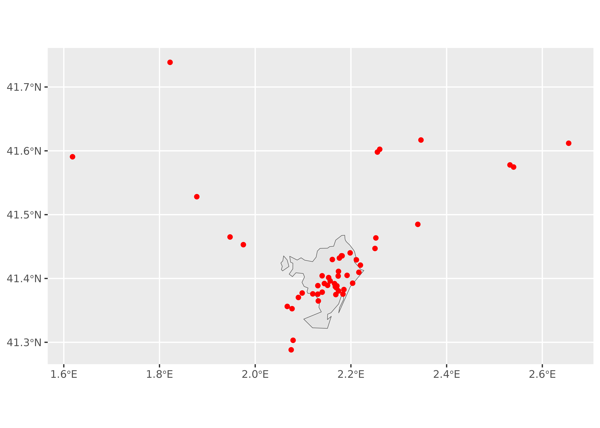
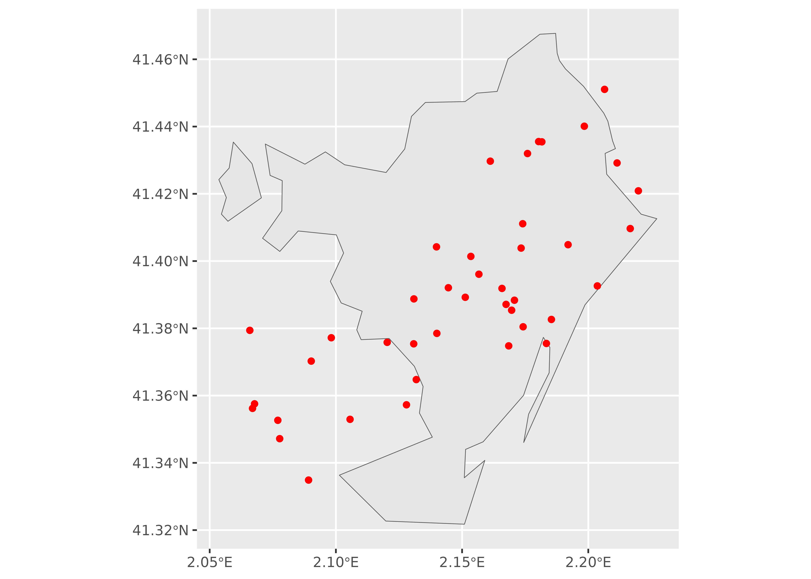
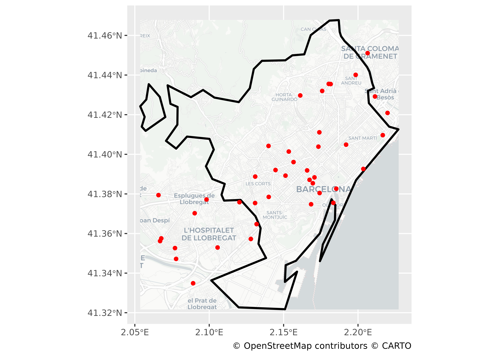

# Static maps with arcgeocoder

## Example 1: Map **sf** objects

This example converts results from **arcgeocoder** into an **sf** object
and displays them on a static map.

``` r

library(arcgeocoder)
library(dplyr)
library(sf) # Work with spatial objects.
library(ggplot2)
library(mapSpain) # Get municipality boundaries for Spain.

# McDonald's restaurants in Barcelona, Spain.

mc <- arc_geo_multi(
  "McDonalds",
  city = "Barcelona",
  region = "Catalonia",
  countrycode = "ES",
  category = "Food",
  limit = 50,
  custom_query = list(outFields = c("LongLabel", "Type", "StAddr"))
)

# Convert to an sf object.
mc_sf <- st_as_sf(
  mc,
  coords = c("lon", "lat"),
  # Use the WKID from the geocoding results.
  crs = mc$latestWkid[1]
)

bcn <- esp_get_munic(munic = "Barcelona") |>
  st_transform(mc$latestWkid[1])

ggplot(bcn) +
  geom_sf() +
  geom_sf(data = mc_sf, color = "red")
```



Figure 1: A map showing the location of McDonald’s restaurants around
Barcelona, Spain

``` r

# Restrict results to the Barcelona bounding box in the query.
bbox <- st_bbox(bcn) |> paste0(collapse = ",")
bbox
#> [1] "2.0536216,41.3217545,2.227167,41.467717"

mc2_sf <- arc_geo_multi(
  "McDonalds",
  city = "Barcelona",
  region = "Catalonia",
  countrycode = "ES",
  category = "Food",
  limit = 50,
  custom_query = list(
    outFields = c("LongLabel", "Type", "StAddr"),
    searchExtent = bbox
  )
) |>
  st_as_sf(coords = c("lon", "lat"), crs = mc$latestWkid[1])

ggplot(bcn) +
  geom_sf() +
  geom_sf(data = mc2_sf, color = "red")
```



Figure 2: A map showing the location of McDonald’s restaurants in
Barcelona, Spain

## Example 2: Add map tiles

The **maptiles** package retrieves static map tiles as **terra**
objects. The **tidyterra** package then adds the tiles to a **ggplot2**
map.

``` r

library(maptiles)
library(tidyterra)

# Use EPSG:3857 to retrieve tiles.
bcn_3857 <- st_transform(bcn, 3857)

osm_tiles <- get_tiles(bcn_3857, provider = "CartoDB.Positron", crop = TRUE)

ggplot() +
  geom_spatraster_rgb(data = osm_tiles, maxcell = Inf) +
  geom_sf(data = bcn, fill = NA, color = "black", linewidth = 1) +
  geom_sf(data = mc2_sf, color = "red") +
  coord_sf(crs = 3857) +
  labs(caption = get_credit("CartoDB.Positron"))
```



Figure 3: A map showing the location of McDonald’s restaurants in
Barcelona, Spain, over an image provided by CARTO
