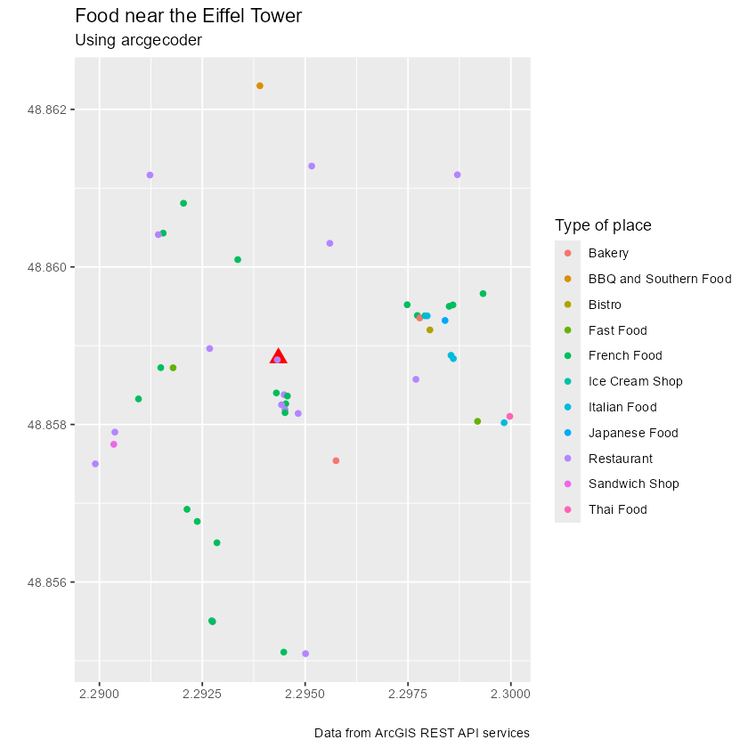

<!-- arcgeocoder.Rmd is generated from arcgeocoder.Rmd.orig. Please edit that file -->


The goal of **arcgeocoder** is to provide a light interface for geocoding
addresses and reverse geocoding locations through the [ArcGIS REST API Geocoding
Service](https://developers.arcgis.com/rest/geocode/api-reference/overview-world-geocoding-service.htm).

Full site with examples and vignettes on
<https://dieghernan.github.io/arcgeocoder/>

## Why **arcgeocoder**?

**arcgeocoder** is a package that provides a lightweight interface for geocoding
and reverse geocoding with the ArcGIS REST API service. The goal of
**arcgeocoder** is to access the ArcGIS REST API with fewer dependencies, such
as **curl** . In some situations, **curl** may not be available or accessible,
so **arcgeocoder** uses base functions to overcome this limitation.

The interface of **arcgeocoder** is built with the aim of easing the access to
all the features provided by the API. The API endpoints used by **arcgeocoder**
are `findAddressCandidates` and `reverseGeocode`, which can be accessed without
the need for an API key.

## Recommended packages

There are other packages much more complete and mature than `nominatimlite`,
that present similar features:

-   [**tidygeocoder**](https://jessecambon.github.io/tidygeocoder/)
    [@R-tidygeocoder]. Allows to interface with ArcGIS, Nominatim
    (OpenStreetMaps), Google, TomTom, Mapbox, etc. for geocoding and reverse
    geocoding.
-   [**nominatimlite**](https://dieghernan.github.io/nominatimlite/)
    [@R-nominatimlite]. Similar to **arcgeocoder** but using data from
    OpenStreetMaps trough the [Nominatim
    API](https://nominatim.org/release-docs/latest/) service.

## Usage

### Geocoding and reverse geocoding

*Note: examples adapted from **tidygeocoder** package*

In this first example we will geocode a few addresses using the `arc_geo()`
function. Note that **arcgeocoder** works straight away, and you don't need to
provide any API key to start geocoding!


``` r
library(arcgeocoder)
library(dplyr)

# create a dataframe with addresses
some_addresses <- tribble(
  ~name,                  ~addr,
  "White House",          "1600 Pennsylvania Ave NW, Washington, DC",
  "Transamerica Pyramid", "600 Montgomery St, San Francisco, CA 94111",
  "Willis Tower",         "233 S Wacker Dr, Chicago, IL 60606"
)

# geocode the addresses
lat_longs <- arc_geo(some_addresses$addr, lat = "latitude", long = "longitude")
#> 
  |                                                        
  |                                                  |   0%
  |                                                        
  |=================                                 |  33%
  |                                                        
  |=================================                 |  67%
  |                                                        
  |==================================================| 100%
```

Only a few fields are returned from the geocoder service in this example, but
`full_results = TRUE` can be used to return all of the data from the geocoder
service.


|query                                      | latitude|  longitude|address                                                           | score|          x|        y|       xmin|     ymin|       xmax|     ymax| wkid| latestWkid|
|:------------------------------------------|--------:|----------:|:-----------------------------------------------------------------|-----:|----------:|--------:|----------:|--------:|----------:|--------:|----:|----------:|
|1600 Pennsylvania Ave NW, Washington, DC   | 38.89768|  -77.03655|1600 Pennsylvania Ave NW, Washington, District of Columbia, 20500 |   100|  -77.03655| 38.89768|  -77.03755| 38.89668|  -77.03555| 38.89868| 4326|       4326|
|600 Montgomery St, San Francisco, CA 94111 | 37.79516| -122.40273|600 Montgomery St, San Francisco, California, 94111               |   100| -122.40273| 37.79516| -122.40373| 37.79416| -122.40173| 37.79616| 4326|       4326|
|233 S Wacker Dr, Chicago, IL 60606         | 41.87867|  -87.63587|233 S Wacker Dr, Chicago, Illinois, 60606                         |   100|  -87.63587| 41.87867|  -87.63687| 41.87767|  -87.63487| 41.87967| 4326|       4326|


To perform reverse geocoding (obtaining addresses from geographic coordinates),
we can use the `arc_reverse_geo()` function. The arguments are similar to the
`arc_geo()` function, but now we specify the input data columns with the `x` and
`y` arguments. The dataset used here is from the geocoder query above. The
single line address is returned in a column named by the `address`.


``` r
reverse <- arc_reverse_geo(
  x = lat_longs$longitude,
  y = lat_longs$latitude,
  address = "address_found"
)
#> 
  |                                                        
  |                                                  |   0%
  |                                                        
  |=================                                 |  33%
  |                                                        
  |=================================                 |  67%
  |                                                        
  |==================================================| 100%
```


|          x|        y|address_found                                                     |
|----------:|--------:|:-----------------------------------------------------------------|
|  -77.03655| 38.89768|White House, 1600 Pennsylvania Ave NW, Washington, DC, 20500, USA |
| -122.40273| 37.79516|Chess Ventures, 600 Montgomery St, San Francisco, CA, 94111, USA  |
|  -87.63587| 41.87867|The Metropolitan, 233 South Wacker Drive, Chicago, IL, 60606, USA |


It is possible also to search for specific locations within or near a reference
are or location using [category
filtering](https://developers.arcgis.com/rest/geocode/api-reference/geocoding-category-filtering.htm).
See more information in the documentation of the data base `arc_categories`.

In the following example we would look for POIs related with food (i.e.
Restaurants, Coffee Shops, Bakeries) near the Eiffel Tower in France.


``` r
library(ggplot2) # For plotting

# Step 1: Locate Eiffel Tower, using multifield query

eiffel_tower <- arc_geo_multi(
  address = "Tour Eiffel",
  city = "Paris",
  countrycode = "FR",
  langcode = "FR",
  custom_query = list(outFields = "LongLabel")
)

# Display results
eiffel_tower |>
  select(lon, lat, LongLabel)
#> # A tibble: 1 × 3
#>     lon   lat LongLabel                                                                 
#>   <dbl> <dbl> <chr>                                                                     
#> 1  2.29  48.9 Tour Eiffel, 3 Rue de l'Université, 75007, 7e Arrondissement, Paris, Île-…


# Use lon,lat to boots the search and using category = Food
food_eiffel <- arc_geo_categories("Food",
  x = eiffel_tower$lon,
  y = eiffel_tower$lat,
  limit = 50, full_results = TRUE
)

# Plot by Food Type
ggplot(eiffel_tower, aes(x, y)) +
  geom_point(shape = 17, color = "red", size = 4) +
  geom_point(data = food_eiffel, aes(x, y, color = Type)) +
  labs(
    title = "Food near the Eiffel Tower",
    subtitle = "Using arcgecoder",
    color = "Type of place",
    x = "",
    y = "",
    caption = "Data from ArcGIS REST API services"
  )
```



## References
