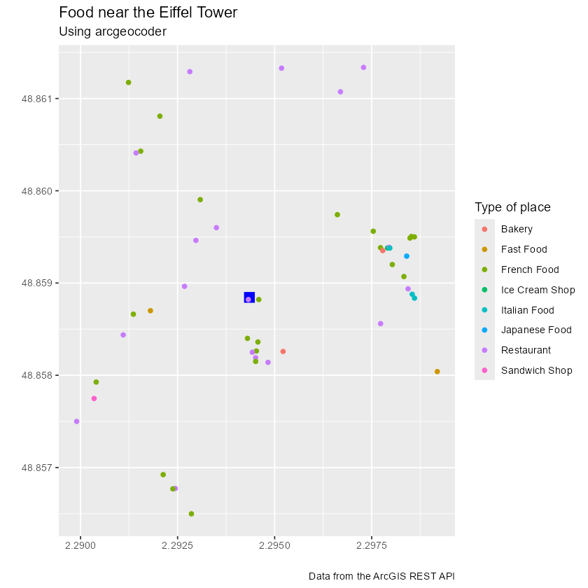

<!-- arcgeocoder.qmd is generated from arcgeocoder.qmd.orig. Please edit that file -->


**arcgeocoder** provides a lightweight interface to the [ArcGIS REST
API](https://developers.arcgis.com/rest/geocode/api-reference/overview-world-geocoding-service.htm).
It geocodes single-line and structured addresses, reverse geocodes coordinates
and finds places by category.

The full site with examples and vignettes is available at
<https://dieghernan.github.io/arcgeocoder/>.

## Why arcgeocoder?

**arcgeocoder** accesses the ArcGIS REST API without requiring an API key or an
additional HTTP package such as **curl**. It uses base R download functions,
which keeps its dependency footprint small.

The package provides focused interfaces to the `findAddressCandidates` and
`reverseGeocode` endpoints. It supports single-line addresses, structured
address components, category filters and reverse geocoding.

## Recommended packages

The following packages provide related geocoding features:

- [**tidygeocoder**](https://jessecambon.github.io/tidygeocoder/)
  [@R-tidygeocoder] provides an interface to ArcGIS, Nominatim (OpenStreetMap),
  Google, TomTom, Mapbox and other geocoding services.
- [**nominatimlite**](https://dieghernan.github.io/nominatimlite/)
  [@R-nominatimlite] is similar to **arcgeocoder** but uses data from
  OpenStreetMap through the [Nominatim
  API](https://nominatim.org/release-docs/latest/).

## Usage

### Geocoding and reverse geocoding

*The examples in this section are adapted from the **tidygeocoder** package.*

The `arc_geo()` function converts single-line addresses into geographic
coordinates. It requires no API key or additional setup.


``` r
library(arcgeocoder)
library(dplyr)

# Create a data frame with addresses.
some_addresses <- tribble(
  ~name, ~addr,
  "White House", "1600 Pennsylvania Ave NW, Washington, DC",
  "Transamerica Pyramid", "600 Montgomery St, San Francisco, CA 94111",
  "Willis Tower", "233 S Wacker Dr, Chicago, IL 60606"
)

# Geocode the addresses.
lat_longs <- arc_geo(
  some_addresses$addr,
  lat = "latitude",
  long = "longitude",
  progressbar = FALSE
)
```

By default, `arc_geo()` returns a small set of fields. Set `full_results = TRUE`
to return all available API fields.

::: {#tbl-geo}


|query                                      | latitude|  longitude|address                                                           | score|          x|        y|       xmin|     ymin|       xmax|     ymax| wkid| latestWkid|
|:------------------------------------------|--------:|----------:|:-----------------------------------------------------------------|-----:|----------:|--------:|----------:|--------:|----------:|--------:|----:|----------:|
|1600 Pennsylvania Ave NW, Washington, DC   | 38.89768|  -77.03655|1600 Pennsylvania Ave NW, Washington, District of Columbia, 20500 |   100|  -77.03655| 38.89768|  -77.03755| 38.89668|  -77.03555| 38.89868| 4326|       4326|
|600 Montgomery St, San Francisco, CA 94111 | 37.79516| -122.40273|600 Montgomery St, San Francisco, California, 94111               |   100| -122.40273| 37.79516| -122.40373| 37.79416| -122.40173| 37.79616| 4326|       4326|
|233 S Wacker Dr, Chicago, IL 60606         | 41.87867|  -87.63587|233 S Wacker Dr, Chicago, Illinois, 60606                         |   100|  -87.63587| 41.87867|  -87.63687| 41.87767|  -87.63487| 41.87967| 4326|       4326|


Example: geocoding addresses.
:::

The `arc_reverse_geo()` function converts longitude and latitude values into
addresses. Supply longitude values to `x` and latitude values to `y`. The
following example uses the coordinates returned by the previous query. The
`address` argument sets the name of the address column in the output.


``` r
reverse <- arc_reverse_geo(
  x = lat_longs$longitude,
  y = lat_longs$latitude,
  address = "address_found",
  progressbar = FALSE
)
```

::: {#tbl-reverse}


|          x|        y|address_found                                                     |
|----------:|--------:|:-----------------------------------------------------------------|
|  -77.03655| 38.89768|White House, 1600 Pennsylvania Ave NW, Washington, DC, 20500, USA |
| -122.40273| 37.79516|Chess Ventures, 600 Montgomery St, San Francisco, CA, 94111, USA  |
|  -87.63587| 41.87867|The Metropolitan, 233 South Wacker Drive, Chicago, IL, 60606, USA |


Example: reverse geocoding addresses.
:::

The `arc_geo_categories()` function finds places by category near a location or
within a bounding box. Available categories are documented in the
`arc_categories` dataset and in the [ArcGIS category filtering
documentation](https://developers.arcgis.com/rest/geocode/api-reference/geocoding-category-filtering.htm).

The following example finds food-related places, such as restaurants, coffee
shops and bakeries, near the Eiffel Tower in France.


``` r
library(ggplot2) # For plotting.

# Step 1: Locate the Eiffel Tower using a structured query.

eiffel_tower <- arc_geo_multi(
  address = "Tour Eiffel",
  city = "Paris",
  countrycode = "FR",
  langcode = "FR",
  custom_query = list(outFields = "LongLabel")
)

# Display results.
eiffel_tower |>
  select(lon, lat, LongLabel)
#> # A tibble: 1 × 3
#>     lon   lat LongLabel                                                                   
#>   <dbl> <dbl> <chr>                                                                       
#> 1  2.29  48.9 Tour Eiffel, 3 Rue de l'Université, 75007, 7e Arrondissement, Paris, Île-de…

# Use `lon` and `lat` as a reference location for `category = "Food"`.
food_eiffel <- arc_geo_categories(
  "Food",
  x = eiffel_tower$lon,
  y = eiffel_tower$lat,
  limit = 50,
  full_results = TRUE
)

# Plot by food type.
ggplot(eiffel_tower, aes(x, y)) +
  geom_point(shape = 15, color = "blue", size = 4) +
  geom_point(data = food_eiffel, aes(x, y, color = Type)) +
  labs(
    title = "Food near the Eiffel Tower",
    subtitle = "Using arcgeocoder",
    color = "Type of place",
    x = "",
    y = "",
    caption = "Data from the ArcGIS REST API"
  )
```



## References
